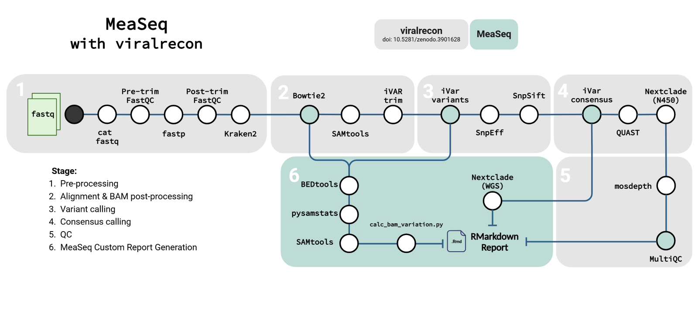

# MeaSeq: Measles Illumina Sequence Analysis Automation
 
- [Introduction](#introduction)
- [Installation](#installation)
    - [Installation Steps](#installation-steps)
    - [Optional Installation Parameters](#optional-installation-parameters)
- [Running](#running)
  - [Quickstart Guide](#quickstart-guide)
  - [Test Dataset](#test-dataset)
- [Outputs](#outputs)
- [Troubleshooting](#troubleshooting)
- [Credits](#credits)
- [Citations](#citations)
- [Contributing](#legal)
- [Legal](#legal)

## Introduction
Measeq is a measles virus specific pipeline established for surveillance and outbreak analysis. The pipeline utilizes a custom configuration of [ViralRecon](https://nf-co.re/viralrecon/2.6.0) output to measure sequencing depth and quality, perform variant annotation, examine genome lengths, and assess gene validity in a measles-specific context. The pipeline culminates in a locally stored HTML report visualizing all the aformentioned components.



This project aims to implement an open-source measles virus Illumina whole genome sequences analysis pipeline. The goal is to generate and nationally deploy a standardized pipeline that is focused on final reporting metrics and plots for rapid detection and response to measles virus outbreaks in Canada and abroad.

## Installation
The pipeline requires all tools and dependencies in the [environment.yml](./measeq/environment.yml) file along with the dependencies for the steps in the ViralRecon pipeline to run from start to completion. For the steps added in the MeaSeq pipeline, the current dependency management tool available which the pipeline is based around is `conda`/`mamba` which can be [installed following the instructions here](https://www.anaconda.com/docs/getting-started/miniconda/install#macos-linux-installation).

For the ViralRecon pipeline and its steps, all of `conda|mamba|docker|singularity` can be passed in as the `--profile`

### Installation Steps
Follow the instructions below to create a new installation of Measeq in your desired location using `conda` or `mamba`:

1. Install conda/mamba for your system following their instructions([conda link](https://www.anaconda.com/docs/getting-started/miniconda/install#macos-linux-installation))

2. Clone the repo to where you want to install it from:
    ```bash
    git clone https://github.com/phac-nml/measeq.git 
    ```

3. Run the installation script
    ```bash
    cd measeq
    ./install.sh
    ```

### Optional Installation Parameters
| Parameter | Description | Accepted Inputs |
| - | - | - |
| `-p` or `--prefix` | Prefix to where the conda environment will be created. | Path to directory |
| `-n` or `--name` | Name of the conda environment to be created | String name | 
| `--use-mamba` | Use mamba instead of conda for the installation | None |

- The installation options follow typical conda naming. 

    - As such, `--prefix` and `--name` can't be used at the same time.

- If `--name` is used or if no parameter is used, then the conda environemnt will be installed to your default conda environments directory.

- If neither `--prefix` nor `--name` options are used, then the installation will occur under the default name: `measeq`.

## Running
You can execute the pipeline with various options depending on which steps of the pipeline you would like to execute and how you want to provide the reference FASTA. Detailed running options are available in [the usage docs](docs/usage.md).

### Quickstart guide
To just get started and run the pipeline, the following basic command is all that is required to do so. This example command works when MeaSeq is installed to your default conda environments directory
```bash
conda activate measeq
measeq -p <PROFILE> -f <PATH/TO/FASTQ> -s <B3/D4/D8/H1> -o <OUT/DIRECTORY>
```

### Test Dataset
To test the `MeaSeq` pipeline, and your installation, a small set of D8 genotype samples have been included from [SRA BioProject PRJNA480551](https://www.ncbi.nlm.nih.gov/bioproject/PRJNA480551) in the [`test_data/fastqs`](test_dataset/fastqs/) directory.

To run these samples after installation, the following command can be used, filling in the parameters as dictated by your system requirements:
```bash
measeq -p <PROFILE> -f <PATH/TO/REPO/testing/fastqs> -s D8
```

## Outputs
---
> If you don't specify an output directory with the `-o` argument, the pipeline will by default create a new directory (`measeq_run_<strain>_<date>`) within your current working directory and output the results there.

The main output of the pipeline, `MeaSeq_Report.html`, gives a summary of the run including sample quality metrics, plots, and any additional information. Detailed pipeline outputs are described [within the output docs](docs/output.md)

## Troubleshooting

For troubleshooting, please open an issue.

## Credits

Written by McMaster University Co-op student - `Ahmed Abdalla`

For questions please contact either:
- Darian Hole (`darian.hole@phac-aspc.gc.ca`)
- Molly Pratt (`molly.pratt@phac-aspc.gc.ca`)

## Citations

> A citation for this pipeline will be available soon.

This pipeline uses code and infrastructure developed and maintained by the [nf-core](https://nf-co.re) community, reused here under the [MIT license](https://github.com/nf-core/tools/blob/master/LICENSE).

> The nf-core framework for community-curated bioinformatics pipelines.
>
> Philip Ewels, Alexander Peltzer, Sven Fillinger, Harshil Patel, Johannes Alneberg, Andreas Wilm, Maxime Ulysse Garcia, Paolo Di Tommaso & Sven Nahnsen.
>
> Nat Biotechnol. 2020 Feb 13. doi: 10.1038/s41587-020-0439-x.
> In addition, references of tools and data used in this pipeline are as follows:

Detailed citations for utilized tools are found in [CITATIONS.md](./CITATIONS.md)

## Contributing
Contributions are welcome through creating PRs or Issues

## Legal
Copyright 2025 Government of Canada

Licensed under the MIT License (the "License"); you may not use this work except in compliance with the License. You may obtain a copy of the License at:

https://opensource.org/license/mit/

Unless required by applicable law or agreed to in writing, software distributed under the License is distributed on an "AS IS" BASIS, WITHOUT WARRANTIES OR CONDITIONS OF ANY KIND, either express or implied. See the License for the specific language governing permissions and limitations under the License.
