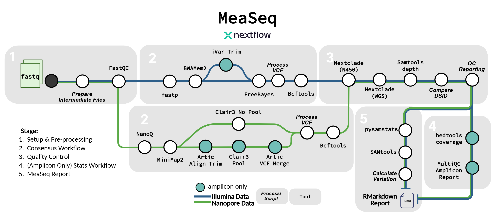

# MeaSeq: Measles Sequence Analysis Automation

- [Current Updates](#current-updates)
- [Introduction](#introduction)
- [Installation](#installation)
- [Resource Requirements](#resources-requirements)
- [Usage](#usage)
  - [Illumina](#illumina)
  - [Nanopore](#nanopore)
    - [Clair3 Models](#clair3-models)
    - [Variant Quality Filtering and Masking Mixed Sites](#variant-quality-filtering-and-masking-mixed-sites)
  - [Reference Assignment](#reference-assignment)
    - [Specifying Singular Reference](#specifying-singular-reference)
  - [Amplicon Data and Primer Files](#amplicon-data-and-primer-files)
    - [Changing the Preset References and Primer Files](#changing-the-preset-references-and-primer-files)
  - [DSIds](#dsids)
  - [Contact Information](#contact-information)
  - [More Run Options](#more-run-options)
  - [Testing](#testing)
- [Outputs](#outputs)
- [Steps](#steps)
  - [Illumina Steps](#illumina-steps)
  - [Nanopore Steps](#nanopore-steps)
- [Troubleshooting](#troubleshooting)
- [Credits](#credits)
- [Citations](#citations)
  - [Preprint](#preprint)
  - [Additional Tools](#additional-tools)
- [Contributing](#contributing)
- [Legal](#legal)

## Current Updates

### _2026-07-06_ Summary

Full release version 1.3.0! Pipeline supports equivalent Illumina and Nanopore workflows allowing whole genome or amplicon sequencing analysis. The MeaSeq workflow generates whole genome consensus sequences, N450 sequences and reporting information, DSId hashing and assigning, and a final QC report. It can be run with a single reference or with the genotyping predictions and a config setup containing a users preferred references.

Major change in version 1.3.0 is the update of [Clair3](https://github.com/HKU-BAL/Clair3/tree/main#v200--feb-9-2026--major-release) from `1.2.0` to `2.0.1`. This should only affect users running with a `--local_model` where they'll need to download the new pytorch models locally. Specifying the model name on the command line will download the pytorch model for the run.

#### Genotype Predictions

- Sample references are set based on the predicted genotype with a default fallback for non-supplied genotypes or unknown/mixed samples.
  - Included in the repo are genotypes: A, B3, D8
  - Includes primer files for artic (run with `-profile artic_primers`) and, by default, the local PHAC scheme.
  - _Recommended_ users set their own references and primers
  - Users can supply their own references for other genotypes or update the current genotype ones based on their needs
  - Users can set their own whole run reference (no predictions or genotype specific analysis) with `--reference <REF>` (and `--primer_bed <BED>` for amplicon).
  - [References Config](conf/reference.config)
  - More total information available in the [References and Predictions section](#reference-assignment)

#### Future Direction and Support

- Updating the final report and maintaining best practices/tool updates as they are released

## Introduction

**MeaSeq** is a measles virus (MeV) specific pipeline established for use in surveillance and outbreak analysis. This pipeline utilizes a reference-based read mapping approach for Whole Genome or Amplicon sequencing data from both the Illumina and Nanopore platforms to output MeV consensus sequences (whole genome and N450), variant data, sequencing qualtiy information, and custom summary reports.



This project aims to implement an open-source, easy to run, MeV Whole Genome Sequence analysis pipeline that works on both Illumina and Nanopore data. The end goal of this project is to deploy a standardized pipeline focused on final reporting metrics and plots for rapid detection and response to MeV outbreaks in Canada and abroad.

The basis of the pipeline come from three other pipelines. The Illumina side from nf-cores' [Viralrecon pipeline](https://github.com/nf-core/viralrecon) along with Jared Simpson's [SARS-CoV-2 pipeline](https://github.com/jts/ncov2019-artic-nf/tree/master) (specficially Freebayes and VCF parsing) and for Nanopore the [artic pipeline](https://github.com/artic-network/fieldbioinformatics) with some slight modifications to different aspects of their variant calling and filtering. Most additions were added for measles-specific QC and reporting based on lab needs at the NML.

## Installation

> [!NOTE]
> If you are new to Nextflow and nf-core, please refer to [this page](https://nf-co.re/docs/usage/installation) on how to set-up Nextflow. Make sure to [test your setup](https://nf-co.re/docs/usage/introduction#how-to-run-a-pipeline) with `-profile test_illumina` before running the workflow on actual data.

Installation requires both [nextflow](https://www.nextflow.io/) at a minimum version of `24.10.0` and a dependency management system to run.

Steps:

1. Download and install nextflow

   1. Download and install with [conda](https://docs.conda.io/en/latest/miniconda.html)
      - Conda command: `conda create -n nextflow -c conda-forge -c bioconda nextflow`
   2. Install with the instructions at https://www.nextflow.io/

2. Determine which dependency management system works best for you

   - _Note_: Currently the plotting process is using a custom docker container but it should work for both docker and singularity

3. Run the pipeline with one of the following profiles to handle dependencies (or use your [own profile](https://nf-co.re/docs/usage/getting_started/configuration)) if you have one for your institution!:
   - `conda`
   - `mamba`
   - `singularity`
   - `docker`

## Resources Requirements

By default, the `bwamem2` step has a minimum resource usage allocation set to `12 cpus` and `72GB memory` using the nf-core `process_high` label.

This can be adjusted (along with the other labels) by creating and passing a [custom configuration file](https://nf-co.re/docs/usage/getting_started/configuration) with `-c <config>`. More info can be found in the [usage doc](./docs/usage.md)

The pipeline has also been tested using as low as `2 cpus` and `8GB memory` with a few throttling steps but functional.

## Usage

### Illumina

First, prepare a samplesheet with your input data that looks as follows for Illumina paired-end data:

**samplesheet.csv**:

```csv
sample,fastq_1,fastq_2
MeVSample01,/PATH/TO/inputread1_S1_L002_R1_001.fastq.gz,/PATH/TO/inputread1_S1_L002_R2_001.fastq.gz
PosCtrl01,/PATH/TO/inputread2_S1_L003_R1_001.fastq.gz,/PATH/TO/inputread2_S1_L003_R2_001.fastq.gz
Sample3,/PATH/TO/inputread3_S1_L004_R1_001.fastq.gz,/PATH/TO/inputread3_S1_L004_R2_001.fastq.gz
```

Each row represents a sample and its associated paired-end Illumina read data.

You can then run the pipeline using:

```bash
nextflow run phac-nml/measeq \
    --input <SAMPLESHEET> \
    --outdir <OUTDIR> \
    --platform illumina \
    -profile <docker/singularity/.../institute>
```

### Nanopore

And as follows for nanopore data:

**samplesheet.csv**

```csv
sample,fastq_1
MeVSample01,/PATH/TO/inputread1.fastq.gz
PosCtrl01,/PATH/TO/inputread2.fastq.gz
Sample3,/PATH/TO/inputread3.fastq.gz
```

Each row represents a sample and its single-end nanopore data.

You can then run the pipeline using:

```bash
nextflow run phac-nml/measeq \
    --input <SAMPLESHEET> \
    --outdir <OUTDIR> \
    --platform nanopore \
    --model <CLAIR3_MODEL> \
    -profile <docker/singularity/institute/etc>
```

#### Clair3 Models

The Nanopore pipeline utilizes [Clair3](https://github.com/HKU-BAL/Clair3) to call nanopore variants which requires a model that should be picked based off of the flowcell, pore, translocation speed, and basecalling model.

Some models are built into clair3 and some need to be downloaded. The [pre-trained clair3](https://github.com/HKU-BAL/Clair3?tab=readme-ov-file#pre-trained-models) models are able to be automatically downloaded when running the pipeline using [`artic get_models`](https://github.com/artic-network/fieldbioinformatics/blob/master/artic/get_models.py) and can be specified as a parameter with `--model <MODEL>`.

Additional or local models can also be used, you just have to provide a path to them and use the `--local_model <PATH>` parameter instead.

#### Variant Quality Filtering and Masking Mixed Sites

In addition to calling variants with Clair3, the Nanopore pipeline will mask sites that are of lower quality (Default: 2 < QUAL < 7) or have a non-consensus level allele frequency (Default: 30% < AF < 60%) with an N in the final consensus. These masked sites can be found in the final HTML report or under the `results/vcf/artic/<sample>.fail.vcf` file.

To adjust this behaviour, you can set the `--min_variant_qual_c3`, `--min_frameshift_qual_c3`, `--min_allele_freq_c3`, and `--min_mask_freq_c3` parameters. Setting them all to 0 will essentially turn off variant filtering other than for low depth sites and will then instead rely solely on clair3's variant calls.

### Reference Assignment

With [MeaSeq v0.5.0](https://github.com/phac-nml/measeq/releases/tag/0.5.0) and later, the `--reference` parameter is no longer required. Instead, the pipeline now runs by default on a per-sample reference assignment based on predicting the input sample's most likely genotype. Included in the pipeline are 3 reference files based on for MeV genotypes B3, D8, and A. If a sample is predicted to be one of these genotypes, then the pipeline processes the sample using the corresponding reference FASTA file. If the sample's most likely genotype doesn't correspond to one of these genotypes, then the pipeline defaults to the set `--default_ref` reference FASTA file which matches the D8 reference genome by default.

It is _highly recommended_ that users evaluate and setup their own reference sequences and especially primer files when running with predictions as they may differ from what is provided by default (PHAC specific references and primers). This should only need to be done once and then the setup can be used for subsequent runs. [Instructions are available](docs/usage.md#specifying-parameters-to-preset-specific-reference-fasta-and-primer-bed-files) to set this up.

#### Specifying Singular Reference

Users can turn off reference prediction and instead run all samples with their own reference genome using the `--reference <FASTA>` parameter.

### Amplicon Data and Primer Files

_Both_ Illumina and Nanopore support running amplicon data using a primer bed file to trim primer positions with either [`iVar`](https://github.com/andersen-lab/ivar) or [`ARTIC`](https://github.com/artic-network/align_trim). To run amplicon data when running with genotype predictions, specify the `--amplicon` parameter and the primer file associated with the predicted genotype will be used to trim the reads.

If running the pipeline with your own reference using `--reference <FASTA>`, you have to specify your own primer bed file with `--primer_bed <PRIMER_BED>` to run amplicon data. The primer bed file details the location of where the primers map to in the reference genome. An example primer bed file looks as such:

**primer.bed**

```
<CHROM>         <START> <END>   <PRIMER_NAME>   <POOL>  <DIRECTION>
MH356245.1      1       25      MSV_1_LEFT      1       +
MH356245.1      400     425     MSV_2_LEFT      2       +
MH356245.1      500     525     MSV_1_RIGHT     1       -
MH356245.1      900     925     MSV_2_RIGHT     2       -
```

To properly pair the primers, make sure that the names match up until the `_LEFT` or `_RIGHT` that mark the primer direction in the primer name. You can also use the following direction extensions in pairing:

- `_LEFT` and `_RIGHT`
- `_L` and `_R`
- `_FORWARD` and `_REVERSE`
- `_F` and `_R`

_Note_: The first line in the example file is just to display what each line expects and should not be included when creating a primer bed file

#### Changing the Preset References and Primer Files

Evalutating and adjusting the preset reference genomes and primer bed files is recommended; especially the primers files if running with amplicon data. To make these adjustments, you can pass a `-params-file` or use the command line to specify genotype reference or primer bed files to change. More detailed information about changing the preset files is found within [the usage file](docs/usage.md#changing-preset-reference-files).

### DSIds

While 24 MeV genotypes were initially identified, only 2 have been detected since 2021: B3 and D8. Due to this, the Distinct Sequence Identifier (DSId) system was created to designate a unique 4-digit identifier based on the precise N450 sequence as a sub-genotype nomenclature. The [Measles Nucleotide Surveillance database](https://who-gmrln.org/means2) (MeaNS) is the global resource for these measles virus genetic sequences that is maintained by the WHO. N450 sequences can be submitted to the database to generate a distinct sequence identifier (DSId) for each unique sequence.

There is no way to query the current database so a multifasta file with DSId calls is required to match locally match them. If a match is found, the matching DSId is assigned! If no match is found, or no DSId file is given, the distinct sequence is given a `Novel-<MD5 HASH>` (first 7 characters) identifier so that it can be submitted to the database and so that same IDs can be grouped together.

To assign known DSIds locally, use the parameter `--dsid_fasta <FASTA>` with the fasta database file structured to look as such:

**dsid_fasta**

```
>1931 D8
GTCAGTTCCACATTGGCATCTGAACTCG
>2001 D8
GTCAGTTCCACATTGGCATCAGAACTCG
>2418 B3
GTCAGTTCCACAGTGGCATCTGAACTCG
```

### Contact Information

Users have the option of including their contact information on the final report of the pipeline to easily allow for the sharing of the report. Information for how to set up and add contact information [is provided in the usage document](./docs/usage.md#contact-information).

### More Run Options

For more detailed running options including adding metadata, adjusting parameters, adding in DSID matches, and more, please refer to [the usage docs](docs/usage.md).

> [!WARNING]
> Please provide pipeline parameters via the CLI or Nextflow `-params-file` option. Custom config files including those provided by the `-c` Nextflow option can be used to provide any configuration _**except for parameters**_; see [docs](https://nf-co.re/docs/usage/getting_started/configuration#custom-configuration-files).

### Testing

To test the `MeaSeq` pipeline, and that everything works on your system, a small set of illumina D8 genotype samples have been included from [SRA BioProject PRJNA480551](https://www.ncbi.nlm.nih.gov/bioproject/PRJNA480551) in the [`test_data/fastqs`](test_dataset/fastqs/) directory.

To run the pipeline on these samples run the following command:

```bash
nextflow run phac-nml/measeq -profile test_illumina,<docker/singularity/institute/etc>
```

## Outputs

The main outputs of the pipeline are the `consensus sequences` (N450 and Full), the `overall.qc.csv` summary table, the `Amplicon-Summary-MultiQC-Report.html` (for amplicon data onle), and the `MeaSeq_Report.html`. The final MeaSeq report gives a summary of the run including sample quality metrics, plots, and any additional information. Detailed pipeline outputs are described [within the output docs](docs/output.md)

## Steps

More detailed steps are available in the [output docs](./docs/output.md)

### Illumina Steps

0. Genotype samples
1. Generate Reference and Primer Intermediates
2. FastQC
3. Illumina Consensus Workflow
   1. FastP
   2. BWAMem2 (or Bowtie2 if `--align_bowtie2` given)
   3. iVar Trim (Amplicon input only)
   4. Picard MarkDuplicates (if parameter given to run)
   5. Freebayes
   6. Process Freebayes VCF
   7. Make Depth Mask
   8. Bcftools Consensus (Ambiguous and Consensus variants)
4. Nextclade (N450 and Custom datasets, N450 fasta output)
5. Samtools depth
6. Compare DSId (Optional with `--dsid_fasta` parameter)
7. Make sample QC
8. Amplicon Summary Workflow (Amp only data)
   1. Bedtools Coverage
   2. Summarize Amplicon Depth
   3. Summarize Amplicon Completeness
   4. MultiQC Amplicon Report
9. Report Workflow
   1. Samtools mpileup
   2. Pysamstats
   3. Rmarkdown

### Nanopore Steps

0. Genotype samples
1. Generate Reference and Primer Intermediates
2. FastQC
3. Nanopore Consensus Workflow
   1. Artic Get Models
   2. NanoQ
   3. Minimap2
   4. Amplicon
      1. Artic Align Trim
      2. Clair3 Pool
      3. Artic VCF Merge
   5. Clair3 No Pool (non-amplicon)
   6. Make Depth Mask
   7. VCF Filter
   8. Artic Mask
   9. Bcftools Norm
   10. Bcftools Consensus
4. Nextclade (N450 and Custom datasets, N450 fasta output)
5. Samtools depth
6. Compare DSId (Optional with `--dsid_fasta` parameter)
7. Make sample QC
8. Amplicon Summary Workflow (Amplicon only data)
   1. Bedtools Coverage
   2. Summarize Amplicon Depth
   3. Summarize Amplicon Completeness
   4. MultiQC Amplicon Report
9. Report Workflow
   1. Samtools mpileup
   2. Pysamstats
   3. Rmarkdown

## Troubleshooting

For troubleshooting, please open an issue or consult [the usage docs](docs/usage.md) to see if they have the information you require. If not, open a ticket.

## Credits

MeaSeq was originally written as an illumina-focused bash pipeline by McMaster University Co-op student - `Ahmed Abdalla` and has now been expanded to cover nanopore data along with being fully converted to Nextflow.

For questions please contact either:

- Darian Hole (`darian.hole@phac-aspc.gc.ca`)
- Molly Pratt (`molly.pratt@phac-aspc.gc.ca`)

## Citations

### Preprint

If you find this pipeline useful, please cite our preprint as:

> Evaluation of MeaSeq: comprehensive analysis and reporting of measles virus whole genome sequences.
> Darian T Hole, Ahmed Abdalla, Vanessa Zubach, Molly Pratt, Stephanie Van Driel, Samar Ashfaq, Joanne Hiebert, Ana T Duggan
> bioRxiv 2026.05.12.724559; doi: https://doi.org/10.64898/2026.05.12.724559

### Additional Tools

This pipeline uses code and infrastructure developed and maintained by the [nf-core](https://nf-co.re) community, reused here under the [MIT license](https://github.com/nf-core/tools/blob/master/LICENSE).

> The nf-core framework for community-curated bioinformatics pipelines.
>
> Philip Ewels, Alexander Peltzer, Sven Fillinger, Harshil Patel, Johannes Alneberg, Andreas Wilm, Maxime Ulysse Garcia, Paolo Di Tommaso & Sven Nahnsen.
>
> Nat Biotechnol. 2020 Feb 13. doi: 10.1038/s41587-020-0439-x.
> In addition, references of tools and data used in this pipeline are as follows:

Detailed citations for utilized tools are found in [CITATIONS.md](./CITATIONS.md)

## Contributing

Contributions are welcome through creating PRs or Issues

## Legal

Copyright 2025 Government of Canada

Licensed under the MIT License (the "License"); you may not use this work except in compliance with the License. You may obtain a copy of the License at:

https://opensource.org/license/mit/

Unless required by applicable law or agreed to in writing, software distributed under the License is distributed on an "AS IS" BASIS, WITHOUT WARRANTIES OR CONDITIONS OF ANY KIND, either express or implied. See the License for the specific language governing permissions and limitations under the License.
