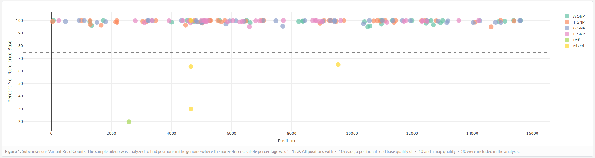

# phac-nml/MeaSeq: Outputs

This document provides an overview of the output generated by the MeaSeq pipeline.

Once the pipeline has completed its run, several directories will be created within the specified output directory. The key outputs of the run are the `overall.qc.csv` file, the `consensus/` sequences, and the `MeaSeq_Report.html` file.

## Index

- [Pipeline Overview](#pipeline-overview)
- [Output Directory Format](#output-directory-format)
  - [Illumina](#illumina)
  - [Nanopore](#nanopore)

## Pipeline Overview

The pipeline is built using Nextflow and processes data using the following steps:

- [Setup](#setup)

  - [Genotype Prediction](#genotype-prediction) - Predict the sample's genotype and choose the correct reference to map reads to
  - [Generate Reference Intermediates](#generate-reference-intermediates) - Generate intermediate files based on the reference for downstream steps
  - [Generate Amplicon Intermediates](#generate-amplicon-intermediates) - Generate intermediate files based on primer bed file for downstream steps
  - [Get Nextclade Reference](#get-nextclade-reference) - Pull the nextclade N450 measles dataset
  - [Nextclade Type Reference](#nextclade-type-reference) - Get the reference genotype using nextclade

- [Illumina Processing](#illumina-processing)

  - [FastQC](#fastqc) - Untrimmed read QC plots
  - [Fastp](#fastp) - Trim paired-end illumina reads
  - [BWAMem2](#bwamem2) - Map to the provided measles reference
  - [iVar Trim](#ivar-trim) - Amplicon only: Trim the BAM file by primer position
  - [Picard MarkDuplicates](#picard-markduplicates) - Optional: Remove optical duplicate reads from BAM file
  - [Freebayes](#freebayes) - Call candidate variants from the BAM file
  - [Process VCF](#process-vcf) - Process candidate variants called from the BAM file using python script and `bcftools norm`
  - [Make Depth Mask](#make-depth-mask) - Determine sites below the minimum depth to mask as Ns
  - [BCFTools Consensus](#bcftools-consensus) - Generate final sample consensus sequence

- [Nanopore Processing](#nanopore-processing)

  - [FastQC](#fastqc) - Untrimmed read QC plots
  - [Artic Get Models](#artic-get-models) - Download clair3 models for analysis
  - [NanoQ](#nanoq) - Trim nanopore reads based for quality and length
  - [Minimap2](#minimap2) - Map to provided measles reference
  - [Artic Align Trim](#artic-align-trim) - Amplicon only: Trim the bam file by primer position to remove primers or reads that don't fit into their amplicon
  - [Clair3](#clair3) - Call candidate variants from BAM file, if amplicon, call variants by amplicon pool and position
  - [Artic VCF Merge](#artic-vcf-merge) - Amplicon only: Merge the pooled VCF files
  - [Make Depth Mask](#make-depth-mask-1) - Determine sites below the minimum depth to mask as Ns
  - [VCF Filter](#vcf-filter) - Filter clair3 variants that don't meet required quality, depth, and allele frequency thresholds
  - [BCFTools Norm](#bcftools-norm) - Normalize final called variants
  - [BCFTools Consensus](#bcftools-consensus-1) - Generate final sample consensus sequence
  - [VCF to TSV](#vcf-to-tsv) - Generate a TSV file based on the VCF to feed into final report

- [Quality Control](#quality-control)

  - [Nextclade](#nextclade) - Run nextclade on N450 dataset to get genotype and on the custom dataset to get frameshift and nonsense mutation information
  - [Samtools Depth](#samtools-depth) - Calculate and summarize per-position depth
  - [Compare DSId](#compare-dsid) - Compare sample N450 to DSId fastas (if available) to assign DSId or Novel hash to type sample
  - [Make Sample QC](#make-sample-qc) - Concatenate relevant sample-specific files for QC evaluation and determine QC result
  - [Make Final QC](#make-final-qc) - Concatenate all sample QC and check controls for a final run evaluation

- [Amplicon Stats Workflow](#amplicon-stats-workflow)

  - [Bedtools Coverage](#bedtools-coverage) - Calculate the depth across each amplicon
  - [Sample Amplicon Depth](#sample-amplicon-depth) - Pull out relevant depth headers and info
  - [Sample Amplicon Completeness](#sample-amplicon-completeness) - Calculate how many Ns are in each amplicon based on the final consensus sequence
  - [Amplicon MultiQC](#amplicon-multiqc) - Summarize amplicon information in final HTML report

- [Reporting Workflow](#reporting-workflow)
  - [Pysamstats](#pysamstats) - Calculate positional base quality
  - [Positional N Depth](#positional-n-depth) - Calculate positional N depth with samtools mpileup
  - [Sample Positional Variation](#sample-variation) - Report positions containing more that 15% variation from the reference call
  - [Software Version Tracking](#software-version-tracking) - Summarize each step's software version to include in final report and as output file
  - [Generate Final Report](#generate-final-report) - Generate final report

### Setup

#### Genotype Prediction

<details markdown="1">
<summary>Output files</summary>

- `prediction.csv`: file containing each sample's predicted genotype with other metrics regarding the prediction quality

</details>

A script is used to predict a sample's genotype using a supplemented measles WHO N450 reference dataset. The predicted genotype is used to select a reference FASTA file for the sample based on the preset genotype specific reference files (A, B3, D8) included with the pipeline. If a sample is either not assigned a genotype or predicted as a not currently supported genotype, then that sample is ran with the set `--default_ref` genome. This is configured to be the same reference file as the D8 genome but can be adjusted.

#### Generate Reference Intermediates

<details markdown="1">
<summary>Output files</summary>

- `reference/`
  - `<REFERENCE>.genome.bed`: Coordinates bed file for the reference genome
  - `<REFERENCE>.fasta.fai`: Reference index file

</details>

Samtools and some manipulations are used to generate the intermediate reference files used in various steps around the pipeline

#### Generate Amplicon Intermediates

<details markdown="1">
<summary>Output files</summary>

- `reference`
  - `<REFERENCE>.amplicon.bed`: Summary amplicon bed file containing amplicon regions from end of Forward primer to start of Reverse
- `reference/amplicon_regions`
  - `<POOL>.<REFERENCE>.bed`: Split amplicon.bed file by pool

</details>

Custom python script that generates amplicon regions from the given primer bed file

#### Get Nextclade Reference

<details markdown="1">
<summary>Output files</summary>

- `nextclade/nextstrain/`: Downloaded measles N450 dataset

</details>

[Nextclade](https://github.com/nextstrain/nextclade) is a bioinformatics tool that is available both at the command-line and a [web-interface](https://clades.nextstrain.org/) and is designed for alignment, phylogenetic placement, and quality assessment of viral genome sequences. It is used here to process consensus sequences against a predefined measles virus reference genome to identify gene validity and frameshift mutations. It also assigns samples to different measles strains based on lineage-defining mutations.

This step pulls the defined Nextclade N450 measles dataset for genotyping both the reference and the output consensus sequences

#### Nextclade Type Reference

<details markdown="1">
<summary>Output files</summary>

- `consensus/`
  - `<REFERENCE>.N450.fasta`: Reference N450 sequence

</details>

Using the N450 dataset, the input reference is typed so that the N450 region can be pulled out and the detected genotype can be used in downstream QC steps

#### FastQC

<details markdown="1">
<summary>Output files</summary>

- `fastqc/`
  - `<SAMPLE>*_fastqc.html`: HTML summary of the pretrimmed reads
  - `<SAMPLE>*_fastqc.zip`: Zip archive containing the fastqc information

</details>

[FastQC](https://www.bioinformatics.babraham.ac.uk/projects/fastqc/) gives general quality metrics and plots for the input reads.

### Illumina Processing

#### Fastp

<details markdown="1">
<summary>Output files</summary>

- `fastp/`
  - `*.fastp.html`: Trimming report in html format.
  - `*.fastp.json`: Trimming report in json format.
  - `*.fastp.log`: Trimming log file.

</details>

[Fastp](https://github.com/OpenGene/fastp) is a tool designed to provide fast, all-in-one preprocessing for FastQ files. It has been developed in C++ with multithreading support to achieve higher performance. Fastp is used in this pipeline for standard adapter trimming and quality filtering.

#### BWAMem2

<details markdown="1">
<summary>Output files</summary>

- `bam/bwamem/`
  - `<SAMPLE>.sorted.bam`: Coordinate sorted BAM file containing read alignment information.
  - `<SAMPLE>.sorted.bam.bai`: Index of Coordinate sorted BAM file containing read alignment information.
- `reference/bwamem2/`: Directory containing the index files for the reference genome

</details>

[BWA-Mem2](https://github.com/bwa-mem2/bwa-mem2) is a tool used to align the input fastq reads to the reference sequence. The output alignments are sorted and indexed with samtools to be used for downstream variant calling and other QC information.

#### iVar Trim

<details markdown="1">
<summary>Output files</summary>

- `bam/ivar/`
  - `<SAMPLE>.primertrimmed.sorted.bam`: Primertrimmed coordinate sorted BAM file containing read alignment information.
  - `<SAMPLE>.primertrimmed.sorted.bam.bai`: Index of primertrimmed coordinate sorted BAM file containing read alignment information.
  - `<SAMPLE>.ivar.log`: Log information from iVar

</details>

[iVar](http://gensoft.pasteur.fr/docs/ivar/1.0/manualpage.html) is used to trim amplicon primer sequences from the aligned reads. iVar uses the primer positions supplied in `--primer_bed` to soft clip primer sequences from a coordinate sorted BAM file.

#### Picard MarkDuplicates

<details markdown="1">
<summary>Output files</summary>

- `bam/picard`
  - `<SAMPLE>.markduplicate.sorted.bam`: Identified candidate variants from the alignment
  - `<SAMPLE>.MarkDuplicates.metrics.txt`

</details>

[Picard MarkDuplicates](https://gatk.broadinstitute.org/hc/en-us/articles/360037052812-MarkDuplicates-Picard) locates, tags, and removes duplicate reads from BAM file

#### Freebayes

<details markdown="1">
<summary>Output files</summary>

- `vcf/freebayes/`
  - `<SAMPLE>.vcf`: Identified candidate variants from the alignment

</details>

[Freebayes](https://github.com/freebayes/freebayes) is a haplotype-based genetic variant caller that finds SNPs and indels in sequencing alignment data.

#### Process VCF

<details markdown="1">
<summary>Output files</summary>

- `vcf/processed_vcf/`
  - `<SAMPLE>.consensus.norm.vcf.gz`: Consensus BCFTools normalized variants to be applied to the consensus sequence
  - `<SAMPLE>.ambiguous.norm.vcf.gz`: Intermediate BCFTools normalized variants to be applied as IUPAC bases to the consensus sequence
  - `<SAMPLE>.processed.norm.vcf.gz`: All filter-passing variants tagged with what type of variant they are
  - `<SAMPLE>.consensus.tsv`: All filter-passing variants in TSV format for use in final reporting script

</details>

The freebayes VCF is processed by a custom python script to determine which variants to apply to the consensus, which are ambiguous and should get IUPAC codes, and which fail filters and should be removed from further analysis.

#### Make Depth Mask

<details markdown="1">
<summary>Output files</summary>

- `mask/`
  - `<SAMPLE>.coverage_mask.txt`: Coordinates of the locations to mask where the depth is less than required to call a base

</details>

Mask locations where there is not enough information to call a base using a minimum threshold and the BAM file.

#### BCFTools Consensus

<details markdown="1">
<summary>Output files</summary>

- `consensus
  - `<SAMPLE>.consensus.fasta`: Final sample consensus sequence with consensus and ambiguous variants applied along with the masked sites

</details>

BCFTools consensus is used to first apply only the IUPAC variants to the sequence, then it is used to create the final consensus sequence with the consensus variants and the depth mask. The final header line is adjusted for easier downstream analysis

### Nanopore Processing

Steps specific to nanopore processing and variant calling

#### Artic Get Models

<details markdown="1">
<summary>Output files</summary>

- `reference/clair3_models/`
  - `<MODEL>`: Directory containing files needed for the wanted clair3 model

</details>

Download and store clair3 model specified with `--model`

#### NanoQ

<details markdown="1">
<summary>Output files</summary>

- `nanoq/`
  - `<SAMPLE>_filtered.fastq`: Final fastq filtered to remove failing reads
  - `<SAMPLE>_filtered.stats`: Final read stats

</details>

#### Minimap2

<details markdown="1">
<summary>Output files</summary>

- `bam/minimap2`
  - `<SAMPLE>.sorted.bam`: Sorted alignments file of reads mapped to given reference
  - `<SAMPLE>.sorted.bam.bai`: Index of the sorted alignments file

</details>

#### Artic Align Trim

<details markdown="1">
<summary>Output files</summary>

- `bam/artic`
  - `<SAMPLE>.amplicon_depths.tsv`: TSV with mean depth for each amplicon calculated
  - `<SAMPLE>.primertrimmed.rg.sorted.bam`: Amplicon primertrimmed and sorted alignments file of reads mapped to given reference
  - `<SAMPLE>.primertrimmed.rg.sorted.bam.bai`: Index of the primertrimmed sorted alignments file

</details>

#### Clair3

<details markdown="1">
<summary>Output files</summary>

- `vcf/clair3`
  - `<SAMPLE>.<POOL>.vcf`: Called variants file for each amplicon pool generated by clair3

</details>

#### Artic VCF Merge

<details markdown="1">
<summary>Output files</summary>

- `vcf/artic`
  - `<SAMPLE>.merged.vcf`: Variants file created by merging the split clair3 variants files

</details>

#### Make Depth Mask

<details markdown="1">
<summary>Output files</summary>

- `mask/`
  - `<SAMPLE>.coverage_mask.txt`: Coordinates of the locations to mask where the depth is less than required to call a base

</details>

Mask locations where there is not enough information to call a base using a minimum threshold and the BAM file.

#### VCF Filter

<details markdown="1">
<summary>Output files</summary>

- `vcf/artic`
  - `<SAMPLE>.fail.vcf`: Merged variants failing the variant filters
  - `<SAMPLE>.pass.vcf.gz`: Merged variants passing the variant filters
  - `<SAMPLE>.pass.vcf.gz.tbi`: Index of passing variants
  - `<SAMPLE>.suppress.txt`: Variants that were suppressed from both the pass and fail VCFs due to their extremely low quality/support

</details>

#### BCFTools Norm

<details markdown="1">
<summary>Output files</summary>

- `vcf/final`
  - `<SAMPLE>.pass.norm.vcf.gz`: Normalized merged variants passing the variant filters
  - `<SAMPLE>.pass.norm.vcf.gz.tbi`: Index of variants

</details>

#### BCFTools Consensus

<details markdown="1">
<summary>Output files</summary>

- `consensus
  - `<SAMPLE>.consensus.fasta`: Final sample consensus sequence with passing consensus variants applied along with the masked sites

</details>

#### VCF to TSV

<details markdown="1">
<summary>Output files</summary>

- `vcf/final`
  - `<SAMPLE>.consensus.tsv`:

</details>

### Quality Control

Quality control modules and reporting

#### Nextclade

<details markdown="1">
<summary>Output files</summary>

- `nextclade/`
  - `<SAMPLE>-N450*`: Nextclade output files coming from the N450 dataset
  - `<SAMPLE>-WG*`: Nextclade output files coming from the custom whole genome dataset
- `consensus/`
  - `<SAMPLE>.N450.fasta`: The N450 sequence of the consensus sequence file

</details>

Nextclade is run using the previously described N450 dataset to determine the genotype of each of the samples along with to pull out the N450 region. It is then run again with a second custom dataset to determine if any of the genes have been unexpectedly distrupted

#### Samtools Depth

<details markdown="1">
<summary>Output files</summary>

- `reporting/positional_depth/`
  - `<REFERENCE>.<SAMPLE>_depth.tsv`: Depth per reference position

</details>

Samtools depth is used to summarize the depth sequenced at all reference genome positions

#### Compare DSId

Comparing the output N450 sequences to a multifasta DSId reference to determine if they match. Novel DSIds are given a `Novel-<HASH>` ID so that they are easy to group and identify

<details markdown="1">
<summary>Output files</summary>

- `dsids.tsv`: TSV file containing each samples DSId call and the completeness of the region
- `novel_dsids.tsv`: TSV file containing the different run `Novel-HASH` DSId calls along with its N450 sequence

</details>

#### Make Sample QC

<details markdown="1">
<summary>Output files</summary>

- `reporting/sample_csv/`
  - `<SAMPLE>.qc.csv`: Individual sample CSV file from combining all of the other pipeline outputs to get a single line of information

</details>

Custom python script combined intermediate and final files to give concatenate all information about the sample into one file and determine if it has any QC issues

#### Make Final QC

<details markdown="1">
<summary>Output files</summary>

- `overall.qc.csv`: Final combined QC information CSV file
- `overall.xlsx`: Final combined QC information file in excel format that also has the genomes in fasta format

</details>

All individual sample QC files are combined into the final run QC file. Negative controls are assessed as well (if provided)

### Amplicon Stats Workflow

Information on amplicons if running in amplicon mode

#### Bedtools Coverage

<details markdown="1">
<summary>Output files</summary>

- `reporting/amplicon/`
  - `<SAMPLE>_amplicon_stats.bed`: Bed file containing information for each amplicon

</details>

[BEDTools](https://bedtools.readthedocs.io/en/latest/index.html) is a powerful suite of command-line utilities designed for genomic analysis, enabling users to manipulate and analyze genomic interval data efficiently. One of its key applications is `coverage` analysis, which determines the depth of sequencing reads aligned to specific genomic regions. This allows for the quantification of how well genomic features are covered by sequencing data.

In the pipeline, we are summarizing positions where 90% of the read is in the amplicon.

#### Sample Amplicon Depth

<details markdown="1">
<summary>Output files</summary>

- `reporting/amplicon/`
  - `<REFERENCE>.amplicon_depth_full.tsv`: Full read depth counts for each amplicon
  - `<REFERENCE>.amplicon_depth_heatmap_mqc.tsv`: Log10 read depth counts for each amplicon for final MultiQC report
  - `SAMPLE_amplicon_depth.tsv`: Individual sample amplicon depth counts

</details>

The full stats file for each sample is broken down to look at how deep each amplicon is sequenced. Then it is summarized in a matrix for MultiQC reporting

#### Sample Amplicon Completeness

<details markdown="1">
<summary>Output files</summary>

- `reporting/amplicon/`
  - `<REFERENCE>.amplicon_completeness_heatmap_mqc.tsv`: Summary matrix of all of the amplicons per sample in the run
  - `<SAMPLE>_amplicon_completeness.tsv`: Individual table for how complete each amplicon in the sample is from 0-1

</details>

The amplicon completeness is calculated from the final consensus sequence based on determining how many Ns are in the amplicon region. The final output per sample is summarized in a matrix for final MultiQC reporting

#### Amplicon MultiQC

<details markdown="1">
<summary>Output files</summary>

- `reporting/`
  - `<REFERENCE>.Amplicon-Summary-MultiQC-Report.html`: file containing plots showing how well each amplicon was sequenced

</details>

MultiQC report specifically focusing on how well and how deep each amplicon was sequenced to help determine if any procedures may be needed.

### Reporting Workflow

#### Pysamstats

<details markdown="1">
<summary>Output files</summary>

- `reporting/positional_quality/`
  - `<SAMPLE>.baseq.stats.tsv`: Summary of per-position quality

</details>

[pysamstats](https://github.com/alimanfoo/pysamstats) is a Python-based tool designed for extracting detailed sequecning statistics from alignment files. It provides base-level summary statistics. Used here is the `baseq` statistic, which represents the average base quality score at each genomic position.

#### Positional N Depth

<details markdown="1">
<summary>Output files</summary>

- `reporting/positional_n/`
  - `<SAMPLE>.per_base_n.tsv`: Summary of how many Ns were seen at each reference position

</details>

Using samtools mpileup and awk, summarize how many Ns were seen at each position in the pileup to find any sites that have a lot of Ns

#### Sample Variation

<details markdown="1">
<summary>Output files</summary>

- `reporting/sample_variation/`
  - `*_variation.csv`: Sample specific genomic positions with variation above 15% from the locations reference basecall

</details>

The base variation check is a Python script that parses the BAM file for each sample to report positions with base variation above specified thresholds (read count: 10, non-reference base perecntage: 15%).



#### Software Version Tracking

<details markdown="1">
<summary>Output files</summary>

- `pipeline_info/`
  - `measeq_software_mqc_versions.yml`: Yaml file tracking the software versions for each step of the pipeline

</details>

Tracking of the software versions used in each step of the pipeline

#### Generate Final Report

<details markdown="1">
<summary>Output files</summary>

- `MeaSeq_Report.html`: Final report with all metrics and visualizations

</details>

The MeaSeq Report HTML file is the final summary of all the samples run by the pipeline generated using RMarkdown. Most of the generated results in the pipeline are included in this report. The report displays sample specifc variant metrics and data visualizations.

If running with a large number of samples, the report may take a second to open up on your web-browser (>100 samples usually)

A sample report generated from publicly available samples can be [found here](images/MeaSeq_Report.html).

## Output Directory Format

### Illumina

Results are all in the `--outdir <RESULTS>` directory created and the main outputs are organized based on grouping file types (BAMs/VCFs/Consensus) while the intermediates are grouped by process (Reference/Reporting)

Format:

```
OUTDIR
├── predictions.csv
├── bam
|  ├── bwamem
|  |   ├── SAMPLE.sorted.bam
|  |   └── SAMPLE.sorted.bam.bai
|  └── ivar (if amplicon)
|      ├── SAMPLE.ivar.log
|      ├── SAMPLE.primertrimmed.sorted.bam
|      └── SAMPLE.primertrimmed.sorted.bam.bai
├── consensus
|   ├── SAMPLE.N450.fasta
|   └── SAMPLE.consensus.fasta
├── fastp
|   ├── SAMPLE_1.fastp.fastq.gz
|   ├── SAMPLE_2.fastp.fastq.gz
|   ├── SAMPLE.fastp.json
|   ├── SAMPLE.fastp.log
|   └── SAMPLE.fastp.html
├── fastqc
|   ├── SAMPLE_fastqc.html
|   └── SAMPLE_fastqc.zip
├── iridanext.output.json.gz
├── mask
|   └── SAMPLE.mask.txt
├──  MeaSeq_Report.html
├── nextclade
|   ├── SAMPLE-N450*
|   └── SAMPLE-WG*
├── overall.qc.csv
├── pipeline_info
|   ├── execution_report.html
|   ├── execution_timeline.html
|   ├── execution_trace.txt
|   ├── measeq_software_mqc_versions.yml
|   ├── params.json
|   └── pipeline_dag.html
├── reference
|   ├── <REFERENCE>.amplicon.bed
|   ├── amplicon_regions
|   |   ├── 1.<REFERENCE>.bed
|   |   ├── 2.<REFERENCE>.bed
|   |   └── etc
|   ├── bwamem
|   |   └── <INDEX FILES>
|   ├── <REFERENCE>.genome.bed
|   └── <REFERENCE>.refstats.txt
├── reporting
    ├── <REFERENCE>.Amplicon-Summary-MultiQC-Report.html (if amplicons)
|   ├── amplicon (if amplicon)
|   |   └── <INTERMEDIATE AMPLICON FILES>
|   ├── positional_depth
|   ├── positional_n
|   ├── positional_quality
|   ├── sample_csv
|   |   └── SAMPLE.qc.csv
|   └── sample_variation
|       └── SAMPLE_variation.csv
└── vcf
    ├── freebayes
    |   └── SAMPLE.vcf
    └── processed_vcf
        ├── SAMPLE.ambiguous.norm.vcf.gz
        ├── SAMPLE.ambiguous.norm.vcf.gz.tbi
        ├── SAMPLE.consensus.norm.vcf.gz
        ├── SAMPLE.consensus.norm.vcf.gz.tbi
        ├── SAMPLE.processed.norm.vcf.gz
        ├── SAMPLE.processed.norm.vcf.gz.tbi
        └── SAMPLE.consensus.tsv
```

### Nanopore

```
OUTDIR
├── predictions.csv
├── bam
|  ├── artic (if amplicons)
|  |   ├── SAMPLE.amplicon_depths.tsv
|  |   ├── SAMPLE.primertrimmed.rg.sorted.bam
|  |   └── SAMPLE.primertrimmed.rg.sorted.bam.bai
|  └── minimap2
|      ├── SAMPLE.sorted.bam
|      └── SAMPLE.sorted.bam.bai
├── consensus
|   ├── SAMPLE.N450.fasta
|   └── SAMPLE.consensus.fasta
├── fastqc
|   ├── SAMPLE_fastqc.html
|   └── SAMPLE_fastqc.zip
├── iridanext.output.json.gz
├── mask
|   └── SAMPLE.mask.txt
├──  MeaSeq_Report.html
├── nanoq
|   ├── SAMPLE_filtered.fastq
|   └── SAMPLE_filtered.stats
├── nextclade
|   ├── SAMPLE-N450*
|   └── SAMPLE-WG*
├── overall.qc.csv
├── pipeline_info
|   ├── execution_report.html
|   ├── execution_timeline.html
|   ├── execution_trace.txt
|   ├── measeq_software_mqc_versions.yml
|   ├── params.json
|   └── pipeline_dag.html
├── reference
|   ├── <REFERENCE>.amplicon.bed
|   ├── amplicon_regions
|   |   ├── 1.<REFERENCE>.bed
|   |   ├── 2.<REFERENCE>.bed
|   |   └── etc
|   ├── clair3_models
|   |   └── <DOWNLOADED MODELS>
|   ├── <REFERENCE>.genome.bed
|   └── <REFERENCE>.refstats.txt
├── reporting
    ├── <REFERENCE>.Amplicon-Summary-MultiQC-Report.html (if amplicons)
|   ├── amplicon (if amplicon)
|   |   └── <INTERMEDIATE AMPLICON FILES>
|   ├── positional_depth
|   ├── positional_n
|   ├── positional_quality
|   ├── sample_csv
|   |   └── SAMPLE.qc.csv
|   └── sample_variation
|       └── SAMPLE_variation.csv
└── vcf
    ├── artic
    |   ├── SAMPLE.fail.vcf
    |   ├── SAMPLE.merged.vcf
    |   ├── SAMPLE.pass.vcf.gz
    |   └── SAMPLE.pass.vcf.gz.tbi
    ├── clair3
    |   └── SAMPLE.POOL.vcf
    └── final
        ├── SAMPLE.consensus.tsv
        ├── SAMPLE.pass.norm.vcf.gz
        └── SAMPLE.pass.norm.vcf.gz.tbi
```
