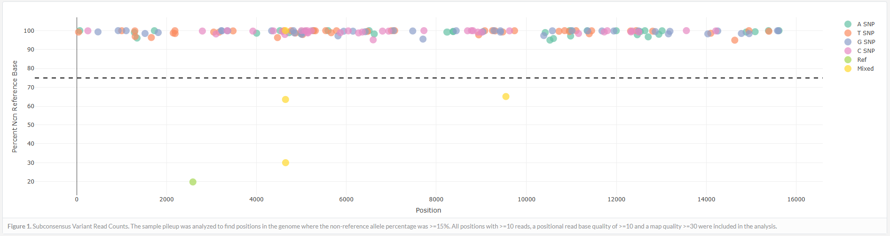
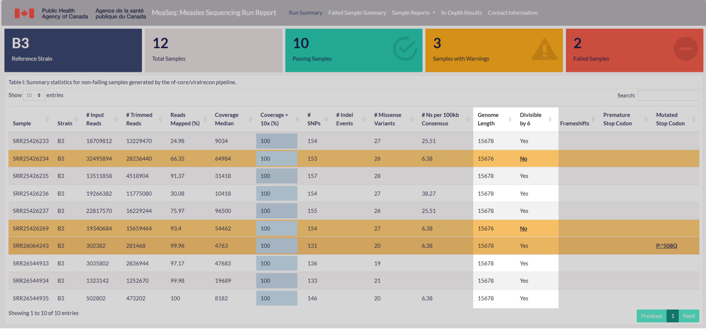
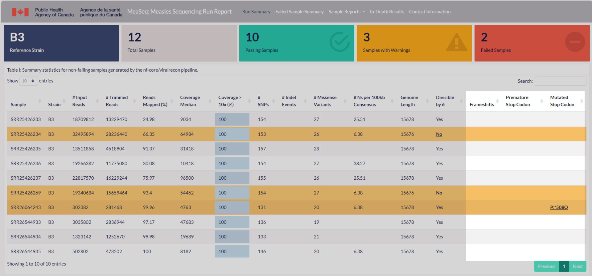

# Introduction

This document provides an overview of the output generated by the MeaSeq pipeline.

Once the pipeline has completed its run, several directories will be created within the specified output directory. The key output of the run is the Run Report HTML file, which compiles and visualizes various results, including all the generated plots.

## Output directory format

```
measeq_run_<strain>_<date> (main output directory)
├── results_measeq/
│    ├── all_variation_positions
│    ├── bam_bai_files
│    ├── consensus_files
│    ├── indels (if applicable)
│    ├── nextclade
│    ├── position_depth
│    ├── position_n_density
│    ├── position_quality
│    ├── variant_tsvs
│    ├── vcf_files
│    └── genome_lengths.txt
├── results_viralrecon/
│    ├── fastp
│    ├── fastqc
│    ├── multiqc
│    ├── nextclade
│    ├── pipeline_info
│    └── variants
├── log_files/
│    ├── measeq.log
│    ├── nf-viralrecon.log
│    └── .nextflow.log
├── work/
├── MeaSeq_Report.html
└── samplesheet.csv
```

## Viralrecon: Pipeline highlights

The viralrecon pipeline outputs are well detailed in the pipeline's [outputs documentation](https://github.com/nf-core/viralrecon/blob/master/docs/output.md).

The following are highlighted outputs that are necessary for the rest of the MeaSeq pipeline.

- [Bowtie 2](#bowtie-2) - Read alignment relative to reference genome
- [SAMtools](#samtools) - Sort, index and generate metrics for alignments
- [iVar variants](#ivar-variants) - Variant calling
- [iVar consensus](#ivar-consensus) - Consensus sequence generation
- [MultiQC](#multiqc) - Present QC for raw reads, alignment, assembly and variant calling

### Bowtie 2

<details markdown="1">
<summary>Output files</summary>

- `variants/bowtie2/log/`
  - `*.bowtie2.log`: Bowtie 2 mapping log file.

</details>

[Bowtie 2](http://bio-bwa.sourceforge.net/) is an ultrafast and memory-efficient tool for aligning sequencing reads to long reference sequences. Bowtie 2 supports gapped, local, and paired-end alignment modes.

### SAMtools

<details markdown="1">
<summary>Output files</summary>

- `variants/bowtie2/`
  - `<SAMPLE>.sorted.bam`: Coordinate sorted BAM file containing read alignment information.
  - `<SAMPLE>.sorted.bam.bai`: Index file for coordinate sorted BAM file.

</details>

Bowtie 2 BAM files are further processed with [SAMtools](http://samtools.sourceforge.net/) to sort them by coordinate, for indexing, as well as to generate read mapping statistics.

### iVar variants

<details markdown="1">
<summary>Output files</summary>

- `variants/ivar/`
  - `*.tsv`: Original iVar variants in TSV format.
  - `*.vcf.gz`: iVar variants in VCF format. Converted using custom `ivar_variants_to_vcf.py` python script.

</details>

[iVar](https://github.com/andersen-lab/ivar/blob/master/docs/MANUAL.md) is a computational package that contains functions broadly useful for viral amplicon-based sequencing. iVar is used in this pipeline to [trim primer sequences](#ivar-trim) for amplicon input data as well as to call variants.

iVar outputs a tsv format which is not compatible with downstream analysis such as annotation using SnpEff. The viralrecon pipeline uses a custom Python script [ivar_variants_to_vcf.py](https://github.com/nf-core/viralrecon/blob/master/bin/ivar_variants_to_vcf.py) to convert the default iVar output to VCF.

### iVar consensus

<details markdown="1">
<summary>Output files</summary>

- `variants/<CALLER>/consensus/ivar/`
  - `*.consensus.fa`: Consensus Fasta file generated by iVar.

</details>

As described in the [iVar variants](#ivar-variants) section, iVar can be used in this pipeline to call variants and for the consensus sequence generation.

### MultiQC

<details markdown="1">
<summary>Output files</summary>

- `multiqc/`
  - `summary_variants_metrics_mqc.csv`: file containing a selection of read alignment and variant calling metrics. The same metrics will also be added to the top of the MultiQC report.

</details>

[MultiQC](http://multiqc.info) is a visualization tool that generates a single HTML report and a summary table of read alignment and variant calling metrics summarizing all samples in your run.

Results generated by MultiQC collate pipeline QC from FastQC, fastp, Cutadapt, Bowtie 2, samtools, BCFTools, SnpEff and QUAST.

## MeaSeq: Pipeline overview

The pipeline uses the previously mentioned outputs from viralreon to conduct the following steps:

- [Sample Variation](#sample-variation) - Calculate base variation
- [BEDTools](#bedtools) - genomic coverage analysis
- [pysamstats](#pysamstats) - base-specific quality scores
- [SAMtools](#samtools-1) - create pileup files for ambigious base density
- [INDEL Check](#indel-check) - quality check for insertions and deletions
- [nextclade](#nextclade) - gene validity, strain assignment, and frameshift mutations
- [Run Report](#run-report) - Custom reporting for variant metrics and sample specific plots

Most of the figures here are taken from the [MeaSeq Report](images/MeaSeq_Report.html), which summarises results at the end of the pipeline.

The directories listed below will be created in the `results_measeq` directory after the pipeline has finished.

### Sample Variation

<details markdown="1">
<summary>Output files</summary>

- `results_measeq/all_variation_positions/`
  - `*_variation.csv`: Sample specific genome positions with base variation

</details>

The base variation check is a Python script that parses the BAM file for each sample to report positions with base variation above specified thresholds (read count: 10, non-reference base perecntage: 15%).



### BEDTools

<details markdown="1">
<summary>Output files</summary>

- `results_measeq/position_depth/`
  - `*_per_base_coverage.bed`: Sample specific genome positions with sequencing depth

</details>

[BEDTools](https://bedtools.readthedocs.io/en/latest/index.html) is a powerful suite of command-line utilities designed for genomic analysis, enabling users to manipulate and analyze genomic interval data efficiently. One of its key applications is `coverage` analysis, which determines the depth of sequencing reads aligned to specific genomic regions. This allows for the quantification of how well genomic features are covered by sequencing data.


### pysamstats

<details markdown="1">
<summary>Output files</summary>

- `results_measeq/position_quality/`
  - `*_qbase.txt`: Sample specific genome positions with sequencing quality

</details>

[pysamstats](https://github.com/alimanfoo/pysamstats) is a Python-based tool designed for extracting detailed sequecning statistics from alignment files. It provides base-level summary statistics. Used here is the `baseq` statistic, which represents the average base quality score at each genomic position.


### SAMtools

<details markdown="1">
<summary>Output files</summary>

- `results_measeq/position_n_density/`
  - `*_per_base_n_content.txt`: Sample specific genome positions with the number of ambiguous bases called at that position across reads

</details>

[SAMTools](http://samtools.sourceforge.net/) is a widely used suite of command-line tools for handling high-throughput sequencing data by sorting, indexing, filtering, and variant calling. It is used within this pipeline to generate a pileup file that is parsed to find the number of ambiguous reads at each genomic position.


### INDEL Check

<details markdown="1">
<summary>Output files</summary>

- `results_measeq/indels/`
  - `indels.csv`: Sample specific genome positions with sequencing quality

</details>

The check for insertions and deletions is carried out using an R script that utilizes the `data.table` and `dplyr` packages to extract the REF (reference allele) and ALT (alternative allele) columns. It identifies insertions and deletions by checking where the length of the ALT allele is different from the REF allele.

### Genome Length

<details markdown="1">
<summary>Output files</summary>

- `results_measeq/indels/genome_length.txt`

</details>

Measles virus specific genome length validity is measured by the consensus sequence's conformation to the rule-of-six by checking if the final genome length is divisible by six.



### Nextclade

<details markdown="1">
<summary>Output files</summary>

- `results_measeq/nextclade/`
  - `nextclade.tsv`: Gene validity metrics

</details>

[Nextclade](https://github.com/nextstrain/nextclade) is a bioinformatics tool that is available both at the command-line and a [web-interface](https://clades.nextstrain.org/) and is designed for alignment, phylogenetic placement, and quality assessment of viral genome sequences. It is used here to process consensus sequences against a predefined measles virus reference genome to identify gene validity and frameshift mutations. It also assigns samples to different measles strains based on lineage-defining mutations.



### MeaSeq Report

<details markdown="1">
<summary>Output files</summary>

- `MeaSeq_Report.html`: Final report with all metrics and visualizations

</details>

The MeaSeq Report HTML file is the final summary of all the samples run by the pipeline generated using RMarkdown. Most of the generated results in the pipeline are included in this report. The report displays sample specifc variant metrics and data visualizations.

A sample report generated from publicly available samples can be [found here](images/MeaSeq_Report.html).

#### The Report also highlights samples with warnings or samples that fail the viralrecon pipeline.

Samples are classified as a `Warning` for a few reasons:

1. The samples `Strain` does not match the reference

2. The samples `coverage >10x` is `<90`

3. The sample is `Not Divisible by 6`

4. The sample contains an identified `Frameshift` mutation

5. The sample contains a `Premature Stop Codon` or a `Mutated Stop Codon`

> If a sample is classified as a `Warning` it is recommended to take a look at the underlying data in the specific `Sample Report` page to explore more and potentially curate it before using it in any further analyses.

Samples are classified as failed for two reasons:

1. The number of mapped reads in viralrecon is `<1000`

2. The samples `coverage >10x` is `<50`
